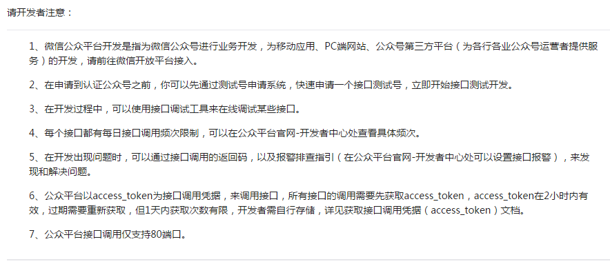
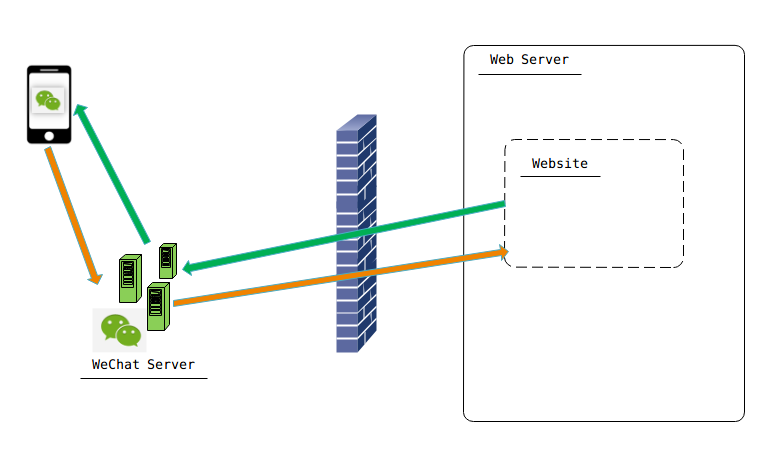
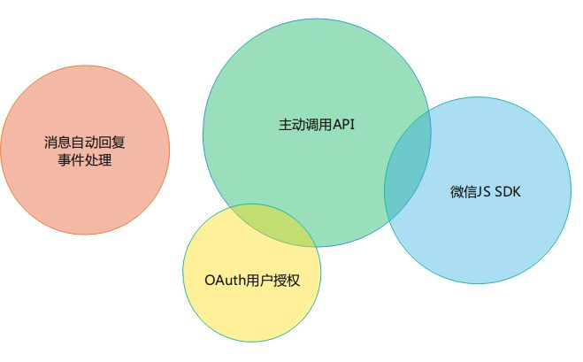

微信公众平台开发入门（使用.NET）
=========

## 为什么要学习微信开发？
1. 微信的用户量巨大，已经成为一个平台
2. 移动时代，你需要学会App开发。但是，有人说：[别开发  app 了](http://mp.weixin.qq.com/s?__biz=MjM5ODQwMjA4MA==&mid=2649293557&idx=1&sn=98f34bb53a54331887cb99972c89e1bc&scene=1&srcid=0814pzrNvADLn20Poq0XWwKW#rd)
3. 学习微信公众平台 API 的设计。這是一个互联时代，到处都是 API 。

## 微信开发出来的应用长什么样？
1. 记账机器人
2. 信昌信息科技

## 概述
1. [微信公众平台开发文档](https://mp.weixin.qq.com/wiki)：
    
2. 两种交互形式：消息会话；公众号内网页。
   消息会话：群发消息；被动回复消息；客服消息；模板消息。
   公众号内网页：网页授权获取用户基本信息；微信JS-SDK（开发者在网页上通过JavaScript代码使用微信原生功能的工具包，开发者可以使用它在网页上录制和播放微信语音、监听微信分享、上传手机本地图片、拍照等许多能力）
3. 微信公众号应用的架构：
   
4. 微信公众号接口分类：
   

## 基本概念
1. 微信公众号的分类：订阅号，服务号，企业号，三者有[区别](https://kf.qq.com/faq/140806zARbmm140826M36RJF.html)。个人可以申请到订阅号和企业号，但是无法申请认证。
2. 开发和测试可以使用测试号，申请很方便。[测试号申请入口](http://mp.weixin.qq.com/debug/cgi-bin/sandbox?t=sandbox/login)
3. 微信公众号的原始ID，AppID（应用ID），AppSecret（应用密钥），[access_token](http://mp.weixin.qq.com/wiki/11/0e4b294685f817b95cbed85ba5e82b8f.html)，
4. URL(服务器地址，必须是80端口或者443端口)，Token(令牌) ，EncodingAESKey(消息加解密密钥)。
5. openid
6. 域名：业务域名，JS接口安全域名，OAuth网页授权回调域名。域名必须备案。
7. 接入指南：[微信公众平台接入指南](http://mp.weixin.qq.com/wiki/17/2d4265491f12608cd170a95559800f2d.html)

## 准备工作
1. 用自己的微信申请测试号
2. 我没有备案过的域名，也没有外网可以访问的服务器，怎么办？[NATAPP 基于ngrok高速内网穿透服务](https://natapp.cn/)
3. [NATAPP1分钟快速新手图文教程 - NATAPP 基于ngrok高速内网穿透服务](https://natapp.cn/article/natapp_newbie)
4. 开源世界有惊喜，[GitHub上有.NET平台下的微信公众平台SDK封装](https://github.com/JeffreySu/WeiXinMPSDK)

## 记账机器人的实现
1. 下载WeiXinMPSDK的.NetFx 4.0版本，编译部署到本地
2. 配置NATAPP，确保外网能访问
3. 处理用户关注事件：[接收事件推送](http://mp.weixin.qq.com/wiki/2/5baf56ce4947d35003b86a9805634b1e.html)
4. 处理消息自动回复：[接收普通消息](http://mp.weixin.qq.com/wiki/10/79502792eef98d6e0c6e1739da387346.html)

## 微信JS SDK demo
0. 配置JS接口安全域名
1. 自定义菜单 API ：[自定义菜单创建接口](http://mp.weixin.qq.com/wiki/13/43de8269be54a0a6f64413e4dfa94f39.html)
2. 扫一扫及分享到朋友圈：[微信JS-SDK说明文档](http://mp.weixin.qq.com/wiki/7/aaa137b55fb2e0456bf8dd9148dd613f.html)

##  入门之后...
1. OAuth网页授权
2. H5开发：[GitHub - weui/weui: A UI library by WeChat official design team, includes the most useful widgets/modules in mobile web applications.](https://github.com/weui/weui)

